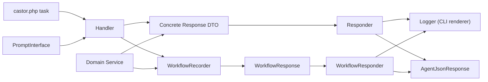

# Engineering Conventions for stud-cli

This document serves as the single source of truth for coding standards, visibility, and testing philosophy for all contributions to `stud-cli`. It ensures that all code is high-quality, maintainable, and highly testable.

## Related Architecture Decision Records (ADRs)

The conventions in this document are informed by architectural decisions documented in our ADRs. For deeper understanding of the "why" behind these conventions, refer to the relevant ADRs:

### Architecture & Patterns
- **[ADR-005: Responder Pattern Architecture](documentation/adr-005-responder-pattern-architecture.md)** - Explains the Action-Domain-Responder pattern used throughout the codebase
- **[ADR-018: Presentation-Owned Translation](documentation/adr-018-presentation-owned-translation.md)** - Documents that localization happens at presentation boundaries
- **[ADR-006: Command Naming Convention](documentation/adr-006-command-naming-convention.md)** - Documents the `object:verb` command naming pattern
- **[ADR-007: Migration System Architecture](documentation/adr-007-migration-system-architecture.md)** - Details the configuration migration system
- **[ADR-009: Service Locator Pattern in castor.php](documentation/adr-009-service-locator-pattern-in-castor.md)** - Explains how services are provided via helper functions

### Conventions & Best Practices
- **[ADR-008: Visibility and Testability Conventions](documentation/adr-008-visibility-and-testability-conventions.md)** - Rationale for `protected` vs `private` visibility choices
- **[ADR-010: Internationalization Strategy](documentation/adr-010-internationalization-strategy.md)** - Translation system and locale handling
- **[ADR-011: Code Quality Metrics and Enforcement](documentation/adr-011-code-quality-metrics-and-enforcement.md)** - Detailed explanation of all quality metrics

### Technical Decisions
- **[ADR-001: FileSystem Abstraction with Flysystem](documentation/adr-001-filesystem-abstraction-with-flysystem.md)** - FileSystem service design
- **[ADR-002: Test Environment Detection](documentation/adr-002-test-environment-detection.md)** - Multi-method test detection strategy
- **[ADR-003: Path Security and Validation](documentation/adr-003-path-security-and-validation.md)** - Security measures for file operations
- **[ADR-004: Test Safety and Isolation](documentation/adr-004-test-safety-and-isolation.md)** - Test isolation strategy

All ADRs are located in the `documentation/` directory.

---

## Code Architecture

### Foundation: PSR-12 & SOLID

All code in `stud-cli` must adhere to:
- **PSR-12**: The PHP coding standard for consistent code style
- **SOLID Principles**: Object-oriented design principles that promote maintainability and extensibility

### The `final` Keyword

The `final` keyword must **not** be used on injectable services (Handlers, Providers) to ensure testability and extensibility. These classes may need to be extended or mocked in tests.

**Use `final` for:**
- Non-injected classes like DTOs (Data Transfer Objects)
- Enums
- Value objects that should not be extended

**Do NOT use `final` for:**
- Handler classes (e.g., `UpdateHandler`, `CommitHandler`)
- Service classes (e.g., `GitRepository`, `JiraService`, `GithubProvider`)
- Any class that is injected via dependency injection

### Visibility Guidelines

Visibility modifiers are a critical aspect of testability and encapsulation:

- **`public`**: For the testable "Public API" of a class. These are the methods that external code (including tests) should interact with.
  - Example: `public function handle(SymfonyStyle $io): int`

- **`protected`**: Our default choice for internal helper methods with logic. This allows them to be unit-tested directly while maintaining encapsulation.
  - Example: `protected function downloadPhar(...): ?string`
  - Example: `protected function replaceBinary(...): int`

- **`private`**: Only for trivial, one-line helpers that don't contain meaningful logic to test.
  - Example: `private function formatDate(string $date): string { return date('Y-m-d', strtotime($date)); }`

**Rationale**: By making complex methods `protected` instead of `private`, we enable direct unit testing of these methods without requiring complex mocking or integration tests. This aligns with our goal of 100% test coverage.

**See also:** [ADR-008: Visibility and Testability Conventions](documentation/adr-008-visibility-and-testability-conventions.md) for detailed rationale and examples.

### Constants, Enums, and Literals

Domain, protocol, provider, configuration, and workflow values must not be hidden as repeated inline literals. Use class constants or enums for values that represent stable concepts, external API keywords, provider states, action names, connection names, output modes, or any value that is used in more than one place.

Inline literals are acceptable when they are local, self-explanatory, and not part of a stable contract. Examples include one-off array keys in a small local transformation, short punctuation separators, or test data that is meaningful only inside a single test. Do not extract literals into constants if the constant name only repeats the value without adding domain meaning.

User-facing text must use translation keys instead of hardcoded display strings. Date/time formats and other locale-sensitive display values must also be configurable through translations or configuration rather than embedded directly in rendering code.

Prefer enums when the set of values is closed and shared across multiple classes. Prefer class constants when values are private to one class or model provider-specific protocol terms.

### Responder Pattern, Diagnostics, and ViewConfig

All features that display user-facing output **must** follow the Action–Domain–Responder flow:

- **Handler:** Pure workflow/business logic only. It may collect input through `PromptInterface`, but it must not render output, call `Logger`, or translate user-facing messages.
- **Service:** Domain services must return domain results or append to non-rendering response/diagnostic collectors. They must not depend on `Logger` or `CommandOutputBuffer`.
- **Response:** Owns user-visible result data and diagnostics (`Error`, `Warning`, `Notice`, `Info`) as `MessageRef` keys plus parameters.
- **WorkflowRecorder:** Handlers record ordered CLI progress via `WorkflowEntryRecorder` (typically `WorkflowRecorder`), then return `WorkflowResponse`. `WorkflowOutput` remains a transitional recorder for castor/service bridges that also handle prompts.
- **Responder:** All presentation logic. It translates message references and uses `PageViewConfig` and `Logger` for CLI output, or serializes the same response through `AgentJsonResponse` for JSON.
- **Task (`castor.php`):** Wires input parsing, Handler, Response, Responder, and exit code handling.



This ensures consistent output behaviour, testability, compact agent JSON, and a single presentation boundary. Architecture tests enforce that handlers and non-presentation services do not reference `Logger`, `CommandOutputBuffer`, or direct rendering methods. Explicit presentation exceptions include `castor.php`, responders, views, prompt implementations, `Logger`, `ResponderHelper`, `HelpService`, `CommandReferenceGenerator`, `AgentModeSchemaGenerator`, `MessageRenderer`, and `TranslationService`.

**See also:** [ADR-005: Responder Pattern Architecture](documentation/adr-005-responder-pattern-architecture.md) for the full ViewConfig inventory, Response/Responder class list, [ADR-013: Responder-Based Dual Output](documentation/adr-013-responder-based-dual-output.md), [ADR-017: Response-Owned Output and Diagnostics](documentation/adr-017-response-owned-output-and-diagnostics.md), and [ADR-018: Presentation-Owned Translation](documentation/adr-018-presentation-owned-translation.md).

### Agent Translation File Strategy

Agent JSON output uses `src/resources/translations/messages.agent.en.yaml` as a sparse, English-only translation domain for agent-facing wording. The file is not a full locale catalog. Add keys there only when agent consumers benefit from wording that is shorter, more contract-oriented, or different from the human CLI wording.

Runtime agent overrides must reuse the same message keys emitted by `MessageRef` (for example `table.key`), while schema/help copy keeps the existing `agent.*` key namespace. When an agent override is missing, responders fall back to the normal English catalog (`messages.en.yaml`) before using the `MessageRef` fallback. This keeps agent JSON stable regardless of the user's configured CLI locale.

CLI responders must continue to render with the configured locale. Agent JSON responders must render `MessageRef` diagnostics, errors, and translated data fields through the agent renderer or the text-safe `TranslationService::renderText()`, `TranslationService::renderForAgentText()`, and `TranslationService::transForAgentText()` helpers.

### Code Quality and Complexity Standards

To maintain code quality and prevent technical debt, all code in `stud-cli` must adhere to the following measurable thresholds. These metrics are enforced through static analysis tools (PHPStan) and manual code review during the development process.

**See also:** [ADR-011: Code Quality Metrics and Enforcement](documentation/adr-011-code-quality-metrics-and-enforcement.md) for detailed explanation of each metric, enforcement strategies, and refactoring guidance.

#### Project Quality Metric Blueprint

The following table defines all quality thresholds that must be met:

| Focus Area | Metric | Threshold | Enforcement |
|------------|--------|-----------|-------------|
| **COMPLEXITY** | Cyclomatic Complexity (CC) | Maximum 10 per method | PHPStan, Code Review |
| | CRAP Index | Maximum 10 per class/method | PHPStan, Code Review |
| | NPath Complexity | Maximum 200 | Static Analysis |
| | Nesting Depth | Maximum 3 | Code Review |
| **COHESION** | LCOM4 (Lack of Cohesion) | Maximum 2 | Static Analysis |
| **SIZE** | Class Size (Lines) | Maximum 400 lines of code | Code Review |
| | Method Size (Lines) | Maximum 40 lines of code | Code Review |
| **SIGNATURES** | Class Properties | Maximum 10 properties | Code Review |
| | Method Arguments | Maximum 4 arguments | Code Review |

#### Complexity Metrics

##### Cyclomatic Complexity (CC)

**Rule**: Maximum Cyclomatic Complexity of **10** for any single method.

**What is Cyclomatic Complexity?** Cyclomatic Complexity measures the number of linearly independent paths through a program's source code. It's calculated by counting decision points (if statements, loops, switch cases, etc.) plus 1.

**Enforcement**: 
- During development (Phase 1 of the AI protocol), all methods that will be modified or created must be assessed for complexity.
- If a method exceeds CC of 10, it MUST be refactored before proceeding with feature implementation.
- Tools like PHPStan, PHPUnit's coverage reports, or static analysis tools can help measure complexity.

**Example of refactoring high complexity:**
```php
// ❌ BAD: High complexity (CC > 10)
public function processData($data) {
    if ($condition1) {
        if ($condition2) {
            if ($condition3) {
                // ... many nested conditions
            }
        }
    }
    // ... more conditions
}

// ✅ GOOD: Refactored into smaller methods (each CC ≤ 10)
public function processData($data) {
    if (!$this->validateData($data)) {
        return false;
    }
    return $this->transformData($data);
}

protected function validateData($data): bool {
    // Simple validation logic (CC ≤ 10)
}

protected function transformData($data) {
    // Simple transformation logic (CC ≤ 10)
}
```

##### CRAP Index

**Rule**: Maximum CRAP Index (Change Risk Analysis and Prediction) of **10** for any new or modified class or method.

**What is CRAP Index?** CRAP Index combines Cyclomatic Complexity with test coverage to predict the risk of changing code. The formula is: `CC² × (1 - coverage/100)³ + CC`

**Enforcement**:
- All new classes and methods must have CRAP Index ≤ 10.
- All modified classes and methods must maintain or improve their CRAP Index to stay ≤ 10.
- If a class or method exceeds CRAP Index of 10, it MUST be refactored (by reducing complexity or increasing test coverage) before proceeding.

**How to reduce CRAP Index**:
1. Reduce Cyclomatic Complexity (break down complex methods).
2. Increase test coverage (write more tests).
3. Extract complex logic into smaller, well-tested classes.

##### NPath Complexity

**Rule**: Maximum NPath Complexity of **200** for any single method.

**What is NPath Complexity?** NPath Complexity measures the number of acyclic execution paths through a method. It provides a more detailed view than Cyclomatic Complexity by considering all possible combinations of decision outcomes.

**Enforcement**:
- Static analysis tools can help identify methods with high NPath Complexity.
- Methods exceeding the threshold should be refactored into smaller, more focused methods.

##### Nesting Depth

**Rule**: Maximum nesting depth of **3** levels.

**What is Nesting Depth?** Nesting depth measures how deeply control structures (if, for, while, switch, etc.) are nested within each other.

**Enforcement**:
- Code review and static analysis tools can identify excessive nesting.
- Deeply nested code should be refactored using early returns, guard clauses, or method extraction.

**Example:**
```php
// ❌ BAD: Nesting depth > 3
public function process($data) {
    if ($condition1) {
        if ($condition2) {
            if ($condition3) {
                if ($condition4) { // Depth 4 - violates rule
                    // ...
                }
            }
        }
    }
}

// ✅ GOOD: Reduced nesting using early returns
public function process($data) {
    if (!$condition1) {
        return;
    }
    if (!$condition2) {
        return;
    }
    if (!$condition3) {
        return;
    }
    // Depth 1 - within threshold
    // ...
}
```

#### Cohesion Metrics

##### LCOM4 (Lack of Cohesion of Methods)

**Rule**: Maximum LCOM4 of **2** for any class.

**What is LCOM4?** LCOM4 measures how well the methods of a class are related to each other through shared instance variables. Lower values indicate better cohesion.

**Enforcement**:
- Static analysis tools can calculate LCOM4.
- Classes with high LCOM4 should be split into multiple, more cohesive classes.

#### Size Metrics

##### Class Size

**Rule**: Maximum **400 lines of code** per class (excluding comments and blank lines).

**Enforcement**:
- Code review and static analysis tools can measure class size.
- Large classes should be split into smaller, focused classes following the Single Responsibility Principle.

##### Method Size

**Rule**: Maximum **40 lines of code** per method (excluding comments and blank lines).

**Enforcement**:
- Code review and static analysis tools can measure method size.
- Large methods should be refactored into smaller, focused methods.

**Example:**
```php
// ❌ BAD: Method exceeds 40 lines
public function processData($data) {
    // ... 50+ lines of code
}

// ✅ GOOD: Split into smaller methods
public function processData($data) {
    $validated = $this->validateData($data);
    $transformed = $this->transformData($validated);
    return $this->saveData($transformed);
}
```

#### Signature Metrics

##### Class Properties

**Rule**: Maximum **10 properties** per class.

**Enforcement**:
- Code review can identify classes with too many properties.
- Classes with many properties may indicate violation of Single Responsibility Principle and should be refactored.

##### Method Arguments

**Rule**: Maximum **4 arguments** per method.

**Exemption**: DTO, Response, and Value Object constructors using promoted `readonly` properties are exempt from the 4-argument limit. These serve as pure data containers with no behavioral complexity; splitting them into sub-objects would add ceremony without reducing cognitive load.

**Enforcement**:
- Code review and static analysis tools can identify methods with too many arguments.
- Methods with many arguments should be refactored using:
  - Parameter objects (DTOs)
  - Builder pattern
  - Method extraction

**Example:**
```php
// ❌ BAD: Too many arguments (> 4)
public function createUser($firstName, $lastName, $email, $phone, $address, $city) {
    // ...
}

// ✅ GOOD: Use a parameter object (DTO)
public function createUser(UserData $userData) {
    // ...
}
```

### Type Safety and Documentation

#### Strict Typing

**Rule**: All PHP files MUST declare `declare(strict_types=1);` at the top of the file.

**Enforcement**: PHP-CS-Fixer and PHPStan can enforce this rule.

#### Type Hints

**Rule**: All method parameters and return types MUST have explicit type hints.

**Enforcement**:
- PHPStan Level 7+ enforces strict type checking.
- Missing type hints will be flagged by static analysis.

**Example:**
```php
// ❌ BAD: Missing type hints
public function processData($data) {
    return $result;
}

// ✅ GOOD: Explicit type hints
public function processData(array $data): array {
    return $result;
}
```

#### Property Type Hints

**Rule**: All class properties MUST have explicit type hints.

**Enforcement**:
- PHPStan Level 7+ enforces property type hints.
- Missing property type hints will be flagged by static analysis.

**Example:**
```php
// ❌ BAD: Missing property type hint
class MyClass {
    private $value;
}

// ✅ GOOD: Explicit property type hint
class MyClass {
    private string $value;
}
```

#### DocBlocks

**Rule**: DocBlocks are required for:
- Public and protected methods (especially those part of the public API)
- Complex methods where the type hint alone doesn't fully explain the behavior
- Methods that throw exceptions

**Enforcement**: Code review and PHPStan can help identify missing DocBlocks.

**Example:**
```php
// ✅ GOOD: DocBlock for complex method
/**
 * Processes user data and returns validation results.
 *
 * @param array<string, mixed> $userData The user data to process
 * @return array{valid: bool, errors: array<string>} Validation results
 * @throws \InvalidArgumentException When user data is malformed
 */
protected function processUserData(array $userData): array {
    // ...
}
```

## Testing & Assertions

### Goal: 100% Test Coverage

**Critical**: 100% test coverage is prioritized over architectural purity. Every line of code that can be tested must be tested. Use `@codeCoverageIgnore` annotations only for truly untestable code paths (e.g., PHAR-specific code, edge cases that cannot be simulated).

**Important**: When using `@codeCoverageIgnore`,  `@codeCoverageIgnoreStart` and `@codeCoverageIgnoreEnd`, these annotations must be on their own lines. If you need to add an explanatory comment, place it on a separate line before the ignore tag:

```php
// Exception from rename() is extremely rare and hard to simulate
// @codeCoverageIgnoreStart
try {
    rename($binaryPath, $backupPath);
} catch (\Exception $e) {
    // ...
}
// @codeCoverageIgnoreEnd
```

**Do NOT** combine the comment with the annotation on the same line:
```php
// ❌ BAD: Comment and annotation on same line
// @codeCoverageIgnoreStart - Exception from rename() is extremely rare
```

### Dependency Isolation in Unit Tests

**Critical Rule**: The use of real service instances (Handlers, Providers, Repositories) in unit tests is **forbidden**. All service dependencies MUST be mocked.

**Why this matters:**
- Unit tests should test a single unit of code in isolation.
- Real service instances can introduce side effects, network calls, file system operations, etc.
- Mocking ensures tests are fast, predictable, and isolated.
- Mocking allows you to control the behavior of dependencies and test edge cases.

**DO NOT use real service instances:**
```php
// ❌ BAD: Using real service instances
public function testHandler() {
    $gitRepository = new GitRepository(); // Real instance
    $jiraService = new JiraService(); // Real instance
    $handler = new UpdateHandler($gitRepository, $jiraService);
    // This test may make real API calls or modify the file system!
}

// ✅ GOOD: Using mocks
public function testHandler() {
    $gitRepository = $this->createMock(GitRepository::class);
    $jiraService = $this->createMock(JiraService::class);
    $handler = new UpdateHandler($gitRepository, $jiraService);
    // This test is isolated and predictable
}
```

**What to mock:**
- Handler classes (e.g., `UpdateHandler`, `CommitHandler`)
- Service classes (e.g., `GitRepository`, `JiraService`, `GithubProvider`)
- Any class that is injected via dependency injection

**What NOT to mock (acceptable to use real instances):**
- Simple value objects (DTOs, Enums)
- Standard library classes (e.g., `DateTime`, `stdClass`)
- Simple utility classes with no external dependencies

### Core Principle: "Test the Intent, Not the Text"

This is a fundamental principle that guides all test writing in `stud-cli`.

**DO NOT assert on specific output strings** like:
```php
// ❌ BAD: Testing implementation details
$this->assertStringContainsString('File not found', $outputText);
$this->assertStringContainsString('Update complete! You are now on v1.0.1', $outputText);
```

**DO assert on:**
1. **Response state and diagnostics** - Verify result DTO fields and `MessageRef` diagnostics:
   ```php
   // ✅ GOOD: Testing behavior, not rendered prose
   $response = $handler->handle();

   $this->assertFalse($response->isSuccess());
   $this->assertSame('item.start.error_not_found', $response->getErrorMessage()->key);
   ```

2. **Function return values** - Test the actual behavior and outcomes:
   ```php
   // ✅ GOOD: Testing the result
   $result = $handler->handle();
   $this->assertSame(1, $result); // Error case returns 1
   $this->assertSame(0, $result); // Success case returns 0
   ```

3. **Thrown exceptions** - Verify that exceptions are thrown when expected:
   ```php
   // ✅ GOOD: Testing exception behavior
   $this->expectException(\RuntimeException::class);
   $this->expectExceptionMessage('Invalid configuration');
   $handler->handle($io);
   ```

**Why this matters:**
- Tests become resilient to refactoring (changing error messages doesn't break tests)
- Tests focus on behavior and outcomes, not implementation details
- Tests remain readable and maintainable
- Tests verify that the code does the right thing, not just that it outputs specific text

## Command Output Conventions

All meaningful command output must be represented in a **Response DTO** or `WorkflowOutput` recorder first. Responders then translate message references and render that response through **Logger** for CLI output or serialize it for agent JSON; see [ADR-005 §7.6 Output and Logger](documentation/adr-005-responder-pattern-architecture.md#76-output-and-logger), [ADR-017](documentation/adr-017-response-owned-output-and-diagnostics.md), and [ADR-018](documentation/adr-018-presentation-owned-translation.md).

Handlers and domain services must not call `Logger` for user-visible output, warnings, errors, progress summaries, or diagnostics. They must also not call `TranslationService::trans()` for user-visible messages. Use `MessageRef` keys plus parameters and let responders or prompt services translate at the presentation boundary. `Logger` is a CLI rendering sink used by responders, `PageViewConfig`, and rendering helpers.

**Exceptions:** Code outside our codebase may render however it needs. Inside this codebase, output rendering is allowed only in documented presentation boundaries: `castor.php`, responders, views, prompt implementations, `Logger`, and presentation/reference helpers. Non-rendering builder APIs such as `MarkdownToAdfConverter::text()` are not considered command output.

The following table defines the standard output intents. Handlers/services record these intents via `ResponseMessage` or `WorkflowOutput`; responders map them to `Logger` methods. The first argument is the minimum verbosity level (`WorkflowOutput::VERBOSITY_NORMAL` or `WorkflowOutput::VERBOSITY_VERBOSE` for verbose-only output):

| Type | Method | Icon | Usage |
|------|--------|------|-------|
| **Success** | `ResponseMessage` success field or `WorkflowOutput::addSuccess()` | ✅ | Use when an operation completes successfully. |
| **Error** | `ResponseMessage::error()` or `WorkflowOutput::addError()` | ❌ | Use when an operation fails. Include technical details in `ResponseMessage::$technicalDetails` when useful. |
| **Warning** | `ResponseMessage::warning()` or `WorkflowOutput::addWarning()` | ⚠️ | Use for non-critical problems that should survive agent-mode serialization. |
| **Notice** | `ResponseMessage::notice()` or `WorkflowOutput::addNote()` | ℹ️ | Use for informational notices. |
| **Info/progress** | Concrete response fields or `WorkflowOutput::addText()` | (none) | Use for progress or decorative CLI output. Keep compact agent JSON free of decorative data unless it is meaningful. |
| **Section** | Concrete response fields or `WorkflowOutput::addSection()` | (none) | Use for CLI section headers in workflow-style commands. |

### Output Best Practices

1. **Keep output responder-owned**: handlers and domain services return responses or record `WorkflowOutput`; responders are the only place that render.
2. **Be concise**: error messages should be clear and actionable.
3. **Use diagnostics for meaningful messages**: warnings, errors, notices, and info that matter to agents belong in `ResponseMessage` diagnostics:
   ```php
   return CommandResponse::error(
       MessageRef::key('update.error_download'),
       [ResponseMessage::error(MessageRef::key('update.error_download'), $e->getMessage())],
   );
   ```
4. **Use `WorkflowOutput` for ordered workflow views**: when an existing command needs progress sections, verbose lines, tables, or raw values, record them without rendering:
   ```php
   $output->addLine(
       WorkflowOutput::VERBOSITY_VERBOSE,
       MessageRef::key('item.start.generated_branch', ['branch' => $branch]),
       WorkflowChannel::Git,
   );
   ```
   Use `WorkflowChannel::Git` for in-flight git/gh operation traces (fetch, push, checkout, branch create/delete, PR API calls). Use `WorkflowChannel::Jira` for in-flight Jira API traces (fetch issue, assign, transition). Omit the channel (default) for command response output: formatted results, summaries, confirmations, and mixed workflow narration. Channels affect CLI coloring only; they do not change verbosity or agent JSON.
5. **Respect compact JSON**: keep decorative/progress output out of compact agent responses. Include diagnostics only when they are meaningful for automated callers.

## CHANGELOG.md Format

The `CHANGELOG.md` file follows the [Keep a Changelog](https://keepachangelog.com/en/1.0.0/) format with the following sections:

- **`### Added`**: For new features and additions
- **`### Changed`**: For updates and modifications to existing functionality
- **`### Fixed`**: For bug fixes
- **`### Breaking`**: For breaking changes that require user action

**Important**: Breaking changes must be placed in the `### Breaking` section. Do not use markers like `[BREAKING CHANGE]`, `[BREAKING]`, or `[REMOVED]` within other sections. Breaking changes should be clearly separated into their own section.

## Static Analysis Tools

### PHP-CS-Fixer

**Purpose**: Automatically enforces PSR-12 code style and consistent formatting.

**Configuration**: `.php-cs-fixer.dist.php`

**Usage**:
```bash
# Check for style violations
vendor/bin/php-cs-fixer fix --dry-run --diff

# Fix style violations automatically
vendor/bin/php-cs-fixer fix
```

**Enforcement**: Run PHP-CS-Fixer before committing code. The tool will automatically correct style violations according to PSR-12 standards.

### PHPStan

**Purpose**: Performs static analysis to catch type errors, identify complex code structures, and enforce type safety.

**Configuration**: `phpstan.neon.dist` (configured to Level 7 minimum)

**Usage**:
```bash
# Run static analysis
vendor/bin/phpstan analyse
```

**Enforcement**: PHPStan must pass at Level 7 or higher before code can be merged. The tool helps identify:
- Type errors and missing type hints
- Complex code structures that may violate complexity thresholds
- Potential bugs and code smells

**AI Agent Tooling**: During Phase 1 (Planning) and Phase 3 (Integrity), the AI Agent must use PHPStan and other static analysis techniques to calculate and enforce all quality metrics listed in the Project Quality Metric Blueprint.

## Documentation and Automation

### Automation and AI Usage

Scripts and AI agents using `stud-cli` MUST use `--agent` mode on commands that support it (JSON input/output, non-interactive). Fall back to `--quiet` / `-q` only when a command lacks `--agent` support. See `AI.md` and `documentation/features/automation.md` for the full AI development protocol.

## Summary

- **Code Architecture**: Follow PSR-12 and SOLID principles. Use `protected` for testable helper methods, avoid `final` on injectable services.
- **Code Quality**: All code must adhere to the Project Quality Metric Blueprint:
  - **Complexity**: CC ≤ 10, CRAP Index ≤ 10, NPath ≤ 200, Nesting Depth ≤ 3
  - **Cohesion**: LCOM4 ≤ 2
  - **Size**: Class ≤ 400 lines, Method ≤ 40 lines
  - **Signatures**: Class Properties ≤ 10, Method Arguments ≤ 4
- **Type Safety**: All files must use `declare(strict_types=1);`. All methods and properties must have explicit type hints. DocBlocks required for public/protected methods and complex logic.
- **Testing**: Aim for 100% coverage. Test the intent (behavior, return values, exceptions) rather than specific output text. All service dependencies must be mocked in unit tests.
- **Static Analysis**: PHP-CS-Fixer enforces PSR-12 style. PHPStan (Level 7+) enforces type safety and helps identify complexity violations.
- **Output**: Keep output responder-owned. Handlers/services return response state or record `WorkflowOutput`; responders render through `Logger` or serialize agent JSON.
- **CHANGELOG**: Use `### Breaking` section for breaking changes, not inline markers.

These conventions ensure that `stud-cli` remains maintainable, testable, and provides a consistent developer experience.

