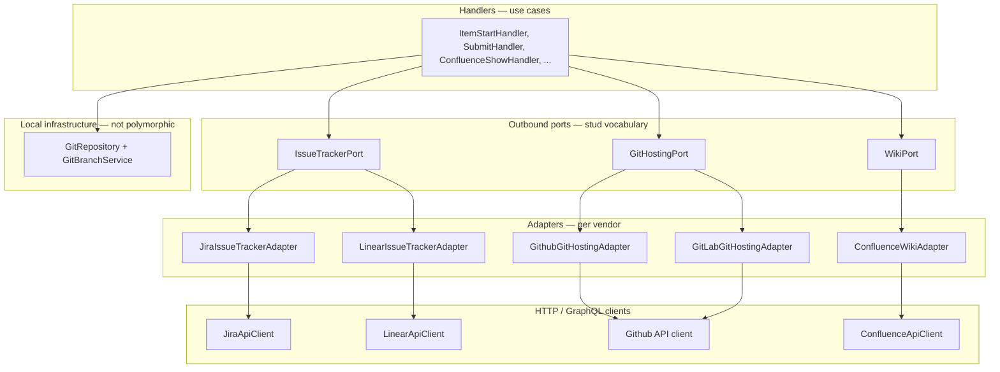

# ADR-023: Integration layering and naming (ports, adapters, config providers)

* **Status:** Accepted
* **Date:** 2026-06-26
* **Authors:** stud-cli maintainers
* **Technical Context:** SCI-143 multi-provider epic, SCI-159–162 work-item port migration, ADR-021 hexagonal outbound ports, ADR-022 scope mapping

## 1. Context and Problem Statement

stud-cli integrates with external systems (local git, GitHub/GitLab, Jira/Linear, Confluence). Naming overloads **Provider** for config tokens, outbound port interfaces, and vendor implementations. The work-item port mixes repository-shaped operations with provider-native query dialects (JQL vs Linear search terms). Contributors reasonably ask whether classes are repositories, adapters, or facades.

**Goal:** A shared glossary and layering model that is accurate enough for collaboration, pragmatic enough to finish the epic, and explicit about what we do **not** build.

stud-cli is an **integration orchestrator**, not an application that owns domain aggregates in a local database.

## 2. Decision Drivers & Constraints

* **ADR-005:** Handlers return Response DTOs; no I/O in handlers.
* **ADR-018:** User-facing text via `MessageRef` at presentation boundaries.
* **ADR-019:** Config provider values (`jira`, `linear`, `github`, `gitlab`) stay backed enums — the word *provider* remains valid in **config** vocabulary.
* **ADR-021:** Command guard complements hexagonal **outbound ports**; marker interfaces stay during migration.
* **ADR-022:** Issue-tracker scope is Jira project / Linear team — injected via config and factory, not per-call opaque parameters on `search()`.
* **YAGNI:** No extra repository layer between handlers and ports; no micro-adapters per issue sub-resource unless a real second use case appears.
* **Pragmatism:** Renames are incremental; user-facing command names (`items:*`, `confluence:*`) stay stable.

## 3. Integration domains

Four outbound integration domains plus local infrastructure:

| Domain | Representative commands | Role |
|--------|-------------------------|------|
| **Local VCS** | `commit`, `push`, `switch`, `branches:*` | Git subprocess + `.git/stud.config` on disk |
| **Remote Git hosting** | `submit`, `pr:*` | PR/MR, labels, review comments on GitHub/GitLab |
| **Issue tracking (PM)** | `items:*`, `projects:*`, `filters:*` | Jira issues / Linear issues (stud `WorkItem` DTO) |
| **Wiki** | `confluence:*` | Confluence pages (separate from issue tracking) |

**Note:** `GitRepository` means *git repository on disk* (see ADR-015). It is **not** a DDD repository and not renamed in this ADR.

## 4. Glossary

| Term | Meaning | Use on |
|------|---------|--------|
| **Provider** (config) | Which vendor integration is enabled in YAML / init | `enum WorkItemProvider`, `GIT_PROVIDERS`, `WORK_ITEM_PROVIDERS` |
| **Port** | Outbound interface handlers depend on; stud-facing vocabulary | `IssueTrackerPort`, `GitHostingPort`, `WikiPort` |
| **Adapter** | Port implementation for one vendor; anti-corruption layer | `JiraIssueTrackerAdapter`, `GithubGitHostingAdapter` |
| **Client** | HTTP/GraphQL + JSON mapping; no handler-facing API | Today: `JiraService`, `ConfluenceService`, inline clients in `GithubProvider` |

**Repository-shaped** describes operation style (`getByKey`, `search`, `create`, `update`). It does not require the class name *Repository* for remote APIs.

**Gateway** describes remote Git hosting operations (PRs, comments) — port concern, not local persistence.

## 5. Port catalogue and current class mapping

Target names are authoritative for new code and renames. Legacy names remain until phased migration (§8).

### Issue tracking (PM)

| Target | Current (legacy) | Notes |
|--------|------------------|-------|
| `IssueTrackerPort` | `WorkItemProviderInterface` | Issue CRUD, search, transitions, attachments, project/team list, discovery metadata |
| `JiraIssueTrackerAdapter` | `JiraWorkItemProvider` | JQL and Jira REST delegation stay inside adapter |
| `LinearIssueTrackerAdapter` | `LinearWorkItemProvider` | SCI-164+ |
| `JiraApiClient` | `JiraService` (+ `JiraAttachmentService`, mappers) | Low-level Jira REST |
| `WorkItemProviderFactory` | same | Resolves config → adapter; rename optional later |

`WorkItem` DTO and `items:*` commands stay for user-facing stability. The port name *IssueTracker* reflects stud scope; the DTO rename is an open question (§9).

### Remote Git hosting

| Target | Current (legacy) | Notes |
|--------|------------------|-------|
| `GitHostingPort` | `GitProviderInterface` | PR/MR, comments, labels, assign |
| `GithubGitHostingAdapter` | `GithubProvider` | |
| `GitLabGitHostingAdapter` | `GitLabProvider` | |

### Wiki

| Target | Current (legacy) | Notes |
|--------|------------------|-------|
| `WikiPort` | *(none — handlers use service directly)* | `getPage`, push/update page |
| `ConfluenceWikiAdapter` | `ConfluenceService` used as client+adapter | Introduce port when wiring benefits tests |

### Local VCS (infrastructure)

| Class | Role |
|-------|------|
| `GitRepository` | Low-level git commands, project config I/O |
| `GitBranchService` | Branch resolution, status, switch helpers |
| `GitSetupService` | Interactive git setup prompts |

Handlers inject these directly — no polymorphic port.

### Config (keep *Provider*)

| Class / enum | Role |
|--------------|------|
| `GitProvider`, `WorkItemProvider` | Stored vendor tokens |
| `GlobalConfigProviderResolver` | Normalize `*_PROVIDERS` lists |

## 6. Decisions (near-term implementation)

### 6.1 Drop `$context` on `search()`

`WorkItemProviderInterface::search(string $query, ?string $context = null)` loses the `$context` parameter.

* Jira: `$query` is JQL end-to-end.
* Linear: `$query` is a search term (SCI-174/175).
* Team/project scope comes from project config and factory-injected adapter state (ADR-022), not a per-call opaque string.

Remove `unset($context)` along with the parameter in SCI-162 or an immediate follow-up on the port interface.

### 6.2 Exceptions: external vs internal

| Kind | Layer | Pattern |
|------|-------|---------|
| **External** (Jira/Linear/Git/Confluence HTTP) | Client / adapter | `ApiException` with English summary + `technicalDetails` — **not** translation keys |
| **Internal** (stud-cli validation, config) | Handler / domain | `MessageRef` keys; translated at responder (ADR-018) |
| **Caught external in handlers** | Handler → Response | Prefer `MessageRef::key('…', ['error' => $e->getMessage()])` over raw `Response::error($e->getMessage())` |

Legacy work-item handlers that pass through `ApiException` messages unchanged are migrated in **SCI-162** and follow-up handler work.

### 6.3 Jira JQL literals

JQL fragments are **protocol vocabulary**, not user-facing copy.

**Do:**

* Class constants for repeated fragments (e.g. `assignee = currentUser()`).
* Backed enum `JiraStatusCategory` for the closed Jira set: `To Do`, `In Progress`, `Done` — used when building JQL (including aligning `JiraService::getProjectTransitions` `statusCategory != Done` when that code is touched).
* One focused builder or private methods on the Jira issue-tracker adapter for `listAssignedActive` JQL.

**Do not (out of scope):**

* Full JQL AST or query object framework.
* Enums for operators (`in`, `!=`, `ORDER BY`).
* Linear query enums until Linear implementation stories need them.

Consolidate duplicated JQL in `ItemListHandler`, `ItemListResponder`, and `JiraWorkItemProvider` when SCI-162 moves list logic behind the port.

## 7. What we deliberately do not do

* **No Handler → Repository → Provider → Client chain.** Handlers → Port → Adapter → Client.
* **No attachment / transition / metadata micro-adapters** split from the issue tracker port — they are operations on the same external issue aggregate.
* **No merge of Confluence into the issue tracker port** — wiki stays a separate port/domain.
* **No mass rename of `GitRepository`** — local git infrastructure; documented exception to the word *repository*.
* **No DTO/command rename** (`WorkItem`, `items:*`) in the same effort as port renames unless explicitly scheduled.
* **No translation keys inside `ApiException`** — established client-layer pattern.

## 8. Phased rename and migration plan

| Phase | When | Actions |
|-------|------|---------|
| **A — Finish epic port wiring** | SCI-162+ | Handlers depend on issue tracker port only; drop `$context`; JQL inside Jira adapter; internal errors → `MessageRef` in touched handlers |
| **B — Glossary in code** | With A or immediately after | ADR-023 (this document); cross-link from ADR-021 |
| **C — Adapter renames** | Touch-driven | `JiraWorkItemProvider` → `JiraIssueTrackerAdapter`; keep class alias or single PR if churn is low |
| **D — Port interface rename** | After C or same PR | `WorkItemProviderInterface` → `IssueTrackerPort`; factory/resolver names follow |
| **E — Git hosting + wiki ports** | Optional chore | `GitProviderInterface` → `GitHostingPort`; introduce `WikiPort` + `ConfluenceWikiAdapter` when confluence handlers need clearer tests |
| **F — Client renames** | Low priority | `JiraService` → `JiraApiClient` internal only |

Phases C–F are **not** blockers for SCI-143 completion.

## 9. Open questions

| Question | Options | Notes |
|----------|---------|-------|
| Port name | `IssueTrackerPort` vs `PmPort` vs keep `WorkItemProviderInterface` | This ADR prefers **IssueTrackerPort** for new docs; legacy name until Phase D |
| Git hosting port name | `GitHostingPort` vs `PullRequestPort` vs `CodeReviewPort` | **GitHostingPort** — covers PRs, comments, labels; not only PRs |
| DTO rename | Keep `WorkItem` vs `TrackedIssue` / `PmIssue` | User-facing `items:*` unchanged; DTO rename high churn, defer |
| `GlobalConfigProviderResolver` rename | `IntegrationConfigResolver` | Cosmetic; optional |
| Split discovery from tracker port | `IssueTrackerDiscoveryPort` | Only if port interface remains too wide after Linear parity |

## 10. Consequences

| Aspect | Result |
|--------|--------|
| Onboarding | (+) Shared vocabulary; less adapter vs repository debate |
| SCI-143 | (+) Clear rules for SCI-162 (handlers, exceptions, `search` signature) |
| Renames | (−) Phased churn in tests, castor helpers, docs |
| Strict DDD | (Neutral) stud-cli stays integration-first; aggregates are external |

## 11. Cross-references

* [ADR-005](adr-005-responder-pattern-architecture.md) — Handler → Response → Responder
* [ADR-015](adr-015-git-repository-decomposition.md) — `GitRepository` scope
* [ADR-018](adr-018-presentation-owned-translation.md) — `MessageRef` at presentation
* [ADR-019](adr-019-closed-prompt-choices-use-backed-enums.md) — config provider enums
* [ADR-021](adr-021-command-readiness-guard.md) — outbound ports + guard
* [ADR-022](adr-022-jira-linear-work-item-scope-mapping.md) — team/project scope
