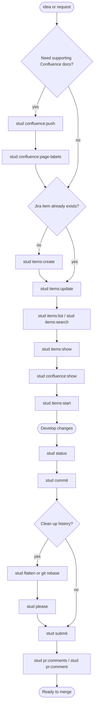

# Workflow Playbook

This playbook shows how the command groups fit together from idea to review. Use it for the big picture, then jump into the generated [command reference](../reference/commands.md) for exact options, aliases, agent JSON input, and output shapes.

## Workflow Schema

The diagram is intentionally visual-only so it renders reliably on GitHub. Use the recipe sections below for clickable command links.



## Recipes

### Create Supporting Docs

Use [`stud confluence:push`](../reference/commands.md#stud-confluence-push) to publish a Markdown page before or during ticket refinement.

```bash
stud confluence:push --space DEV --title "SCI-123 Technical Spec" --file docs/SCI-123.md
stud confluence:page-labels --page 12345 --labels tech-spec,DX
```

When the page already exists, update it with `--page`. Use [`stud confluence:show`](../reference/commands.md#stud-confluence-show) to review a page by id or URL.

### Create Or Enrich A Jira Item

Use [`stud items:create`](../reference/commands.md#stud-items-create) when the work does not exist yet, and [`stud items:update`](../reference/commands.md#stud-items-update) when you need to add labels, tech-spec links, acceptance criteria, or custom fields to an existing item.

```bash
stud items:create --project SCI --type Story --summary "Improve stud-cli workflow docs"
stud items:update SCI-123 --description "Tech spec: https://example.atlassian.net/wiki/spaces/DEV/pages/12345" --fields "labels=DX,docs"
```

Use [`stud items:list`](../reference/commands.md#stud-items-list), [`stud items:search`](../reference/commands.md#stud-items-search), and [`stud items:show`](../reference/commands.md#stud-items-show) to rediscover and inspect work before starting.

### Pick Up Work

Use [`stud items:start`](../reference/commands.md#stud-items-start) for new local work, [`stud switch`](../reference/commands.md#stud-switch) when you already have a local branch for the item key, or [`stud items:takeover`](../reference/commands.md#stud-items-takeover) when continuing an existing branch from local or remote state.

```bash
stud items:show SCI-123
stud confluence:show --url "https://example.atlassian.net/wiki/spaces/DEV/pages/12345"
stud start SCI-123
stud sw SCI-123 --sync
```

### Develop And Commit

Use [`stud status`](../reference/commands.md#stud-status) for a quick dashboard, then [`stud commit`](../reference/commands.md#stud-commit) to create a conventional commit from branch and Jira context.

```bash
stud status
stud commit --all
```

Use [`stud push`](../reference/commands.md#stud-push) when you want to commit and push without opening a PR yet.

### Clean Up History

Use [`stud flatten`](../reference/commands.md#stud-flatten) or a manual rebase when the branch history should be rewritten before review. After any history rewrite, use [`stud please`](../reference/commands.md#stud-please) to perform the guarded force-push.

```bash
stud flatten
stud please
```

Do not use `stud please` as a normal push command. Its main role is after `stud flatten`, `git rebase`, or another intentional history rewrite.

### Submit And Respond To Review

Use [`stud submit`](../reference/commands.md#stud-submit) to push the branch and open the PR/MR with labels. Use [`stud pr:comments`](../reference/commands.md#stud-pr-comments) and [`stud pr:comment`](../reference/commands.md#stud-pr-comment) to inspect and respond to review threads.

```bash
stud submit --labels "AI-Generated,RFR"
stud pr:comments --threaded
stud pr:comment "Addressed in the latest commit." --reply-to github:review_thread:THREAD_ID --resolve
```

For automation or AI-agent usage, prefer the generated agent JSON examples in the [command reference](../reference/commands.md) and pass `--agent` where supported.
