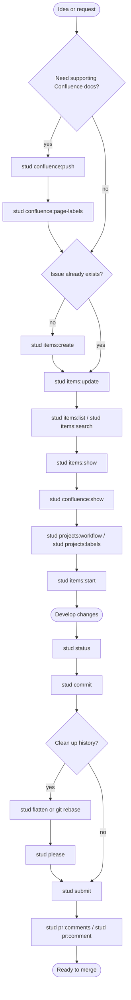

# Workflow Playbook

This playbook shows how the command groups fit together from idea to review. Use it for the big picture, then jump into the generated [command reference](../reference/commands.md) for exact options, aliases, agent JSON input, and output shapes.

Repositories may use **Jira**, **Linear**, or both — see [Configuration](../setup/configuration.md) and [Work items](work-items.md) for provider resolution and `--provider` overrides.

## Workflow schema

The diagram is intentionally visual-only so it renders reliably on GitHub. Use the recipe sections below for clickable command links.


```mermaid
flowchart TD
    idea([Idea or request])
    needDoc{Need supporting Confluence docs?}
    createDoc["stud confluence:push"]
    labelDoc["stud confluence:page-labels"]
    needIssue{Issue already exists?}
    createIssue["stud items:create"]
    updateIssue["stud items:update"]
    findIssue["stud items:list / stud items:search"]
    inspectIssue["stud items:show"]
    inspectDoc["stud confluence:show"]
    discoverMeta["stud projects:workflow / stud projects:labels"]
    startWork["stud items:start"]
    develop([Develop changes])
    status["stud status"]
    commit["stud commit"]
    cleanup{Clean up history?}
    flatten["stud flatten or git rebase"]
    please["stud please"]
    submit["stud submit"]
    review["stud pr:comments / stud pr:comment"]
    done([Ready to merge])

    idea --> needDoc
    needDoc -- yes --> createDoc --> labelDoc --> needIssue
    needDoc -- no --> needIssue
    needIssue -- no --> createIssue --> updateIssue
    needIssue -- yes --> updateIssue
    updateIssue --> findIssue --> inspectIssue
    inspectIssue --> inspectDoc
    inspectDoc --> discoverMeta
    discoverMeta --> startWork
    startWork --> develop --> status --> commit --> cleanup
    cleanup -- yes --> flatten --> please --> submit
    cleanup -- no --> submit
    submit --> review --> done
```

## Recipes

### Create supporting docs

Use [`stud confluence:push`](../reference/commands.md#stud-confluence-push) to publish a Markdown page before or during ticket refinement.

```bash
stud confluence:push --space DEV --title "SCI-123 Technical Spec" --file docs/SCI-123.md
stud confluence:page-labels --page 12345 --labels tech-spec,DX
```

When the page already exists, update it with `--page`. Use [`stud confluence:show`](../reference/commands.md#stud-confluence-show) to review a page by id or URL.

### Configure project metadata (Jira or Linear)

Before first `stud items:start` in a new repo, run [`stud config:project-init`](../reference/commands.md#stud-config-project-init) or discover metadata interactively:

```bash
stud projects:workflow --project SCI
stud projects:labels --project ENG --groups-only
stud config:project-init
```

Jira stores `transitionId`; Linear stores `linearStartStateId`, `linearTypeLabelGroupId`, and optional `linearTypeBranchPrefixes`. See [Configuration](../setup/configuration.md#linear-setup).

### Create or enrich an issue

Use [`stud items:create`](../reference/commands.md#stud-items-create) when the work does not exist yet, and [`stud items:update`](../reference/commands.md#stud-items-update) when you need to add labels, links, acceptance criteria, or custom fields.

```bash
stud items:create --project SCI --type Story --summary "Improve stud-cli workflow docs"
stud items:update SCI-123 --description "Tech spec: https://example.atlassian.net/wiki/spaces/DEV/pages/12345" --fields "labels=DX,docs"
stud items:update ENG-42 --provider linear --fields "labels=Feature"
```

Use [`stud items:list`](../reference/commands.md#stud-items-list), [`stud items:search`](../reference/commands.md#stud-items-search), and [`stud items:show`](../reference/commands.md#stud-items-show) to rediscover and inspect work before starting. Jira accepts JQL in search; Linear accepts a plain term — see [Work items](work-items.md).

### Pick up work

Use [`stud items:start`](../reference/commands.md#stud-items-start) for new local work, [`stud switch`](../reference/commands.md#stud-switch) when you already have a local branch for the item key, or [`stud items:takeover`](../reference/commands.md#stud-items-takeover) when continuing an existing branch from local or remote state.

```bash
stud items:show SCI-123
stud items:show ENG-42 --provider linear
stud confluence:show --url "https://example.atlassian.net/wiki/spaces/DEV/pages/12345"
stud start SCI-123
stud sw ENG-42 --sync
```

### Develop and commit

Use [`stud status`](../reference/commands.md#stud-status) for a quick dashboard, then [`stud commit`](../reference/commands.md#stud-commit) to create a conventional commit from branch and issue context.

```bash
stud status
stud commit --all
```

Use [`stud push`](../reference/commands.md#stud-push) when you want to commit and push without opening a PR yet.

### Clean up history

Use [`stud flatten`](../reference/commands.md#stud-flatten) or a manual rebase when the branch history should be rewritten before review. After any history rewrite, use [`stud please`](../reference/commands.md#stud-please) to perform the guarded force-push.

```bash
stud flatten
stud please
```

Do not use `stud please` as a normal push command. Its main role is after `stud flatten`, `git rebase`, or another intentional history rewrite. If the branch has never been pushed, `stud please` still succeeds: it sets upstream to origin and pushes (CLI shows a notice; agent mode stays quiet).

### Submit and respond to review

Use [`stud submit`](../reference/commands.md#stud-submit) to push the branch and open the PR/MR with labels. Use [`stud pr:comments`](../reference/commands.md#stud-pr-comments) and [`stud pr:comment`](../reference/commands.md#stud-pr-comment) to inspect and respond to review threads.

```bash
stud submit --labels "AI-Generated,RFR"
stud pr:comments --threaded
stud pr:comment "Addressed in the latest commit." --reply-to github:review_thread:THREAD_ID --resolve
```

For automation or AI-agent usage, prefer the generated agent JSON examples in the [command reference](../reference/commands.md) and pass `--agent` where supported.

For label sync from GitHub PR labels to Jira or Linear issues, see [GitHub Actions](../github-actions.md).
